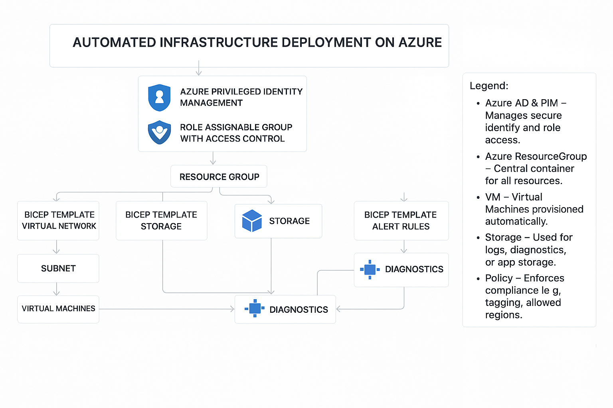

# Automating Azure Infrastructure Deployment with Bicep & GitHub Actions

## **Problem Statement**: 
A software development company aims to improve efficiency by automating the deployment of its Azure infrastructure for various projects. 
The company needs to reduce **manual errors**, ensure **consistency across environments**, and **speed up the deployment process**. 
The automation solution should include **scripting for deploying virtual machines**, **storage accounts**, **networks**, and **security configurations**. 
The automated setup must also incorporate **monitoring** and **alerting to maintain high operational standards**.

## 📖 Project Overview 
This project automates Azure infrastructure deployment using **Bicep templates** and **GitHub Actions**, ensuring **security, scalability, and efficiency** across cloud environments.
This project was built as part of the **TechStylers Cohort 6.0 Deep Dive Project** to automate the deployment of Azure infrastructure using **Bicep templates** and **Azure CLI**.

The infrastructure was deployed using **Infrastructure as Code (IaC)** with **Bicep** and **PowerShell**, enabling fast, consistent, and repeatable builds without manual Azure portal interaction.

Automated resources included **Virtual Networks**, **Subnets**, **Network Security Groups (NSGs)**, **Network Interface Cards (NICs)**, **Windows and Linux Virtual Machines**, and **Azure Storage accounts**. Resources were logically grouped by environment (development, staging, production) to simplify management, enhance security, and support scalability.

Access control was managed through **Microsoft Entra ID** and **Privileged Identity Management (PIM)**, providing just-in-time, role-based access to privileged roles. User provisioning and role assignments were automated via Bicep templates.

Security governance was enforced using Azure Policy, including a policy to restrict VM SKU sizes to approved options, ensuring compliance and cost control. Sensitive credentials were securely managed in Azure Key Vault, while Microsoft Defender for Cloud provided continuous security threat monitoring.

All deployed resources were tagged with project, environment, and owner metadata to support cost tracking, reporting, and operational management.

Monitoring and diagnostics were handled using Azure Monitor and Log Analytics for real-time performance tracking, alerting, and issue resolution.

The deployment process was fully integrated with GitHub Actions, supporting automated, reliable infrastructure rollouts through CI/CD pipelines.

## Features  
✅**Infrastructure-as-Code (IaC)** with Bicep  
✅ **GitHub Actions CI/CD pipeline** for automation  
✅ **Security & Compliance** with Azure Policy & Defender  
✅ **Monitoring & Logging** via Azure Monitor  

## 📁 **Project Bicep Template** 
[**View main.bicep**](./main.bicep)

## 📁 **Project Structure**  

---
